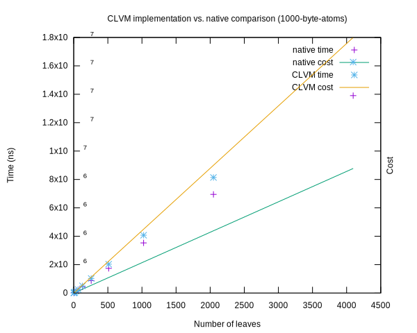
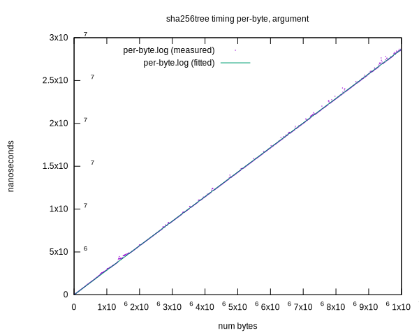
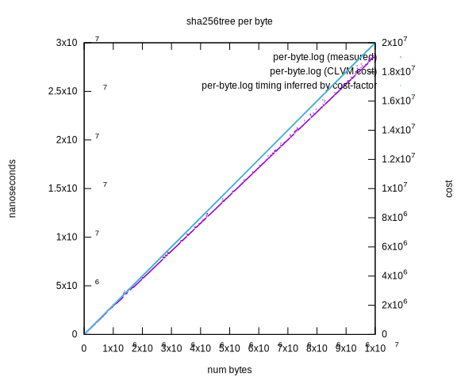

# Information on the new (sha256tree) operator

Adding `sha256tree` as a native operator made sense as it is one of the most
common functions, used in nearly every shipped ChiaLisp puzzle. Furthermore it
has an innate inefficiency in its in-language implementation. Every internal
hash is allocated as an atom in the `Allocator`. In addition to this, a native
operator also opens the door to future optimisations via caching.

## Costing Goals

Since the built-in sha256 tree operator is more efficient than computing the
tree hash in CLVM, it should have a lower cost for all inputs.

It should be costed in proportion to:

- The CPU time to Cost ratio should be in line with other operators, and especially the `sha256` operator
- The CPU time to Cost ratio of the ChiaLisp implementation
- The size of its inputs

`sha256tree` is the first operator whose parameter is a tree, which makes for
more dimensions to consider for the cost model.

One final consideration while costing is that we required it to tally the cost
during the runtime, rather than afterwards - which would be the most efficient
calculation. This is because we want the operation to fail immediately if
`max_cost` is exceeded.

## Costing Methodology

One important observation is that, in any tree, there are exactly one more atom
than the number of pairs. For large tree, it can be approximated to have the
same number of atoms as pairs. For this reason, we ascribe a cost per pair, that
has the cost for an atom baked into it.

Early benchmarks suggested that the cost of traversing the left and right side
of a pair may differ slightly. The benchmark times all of these tree shapes:

- a complete tree
- a right-hand list (i.e. only traverse to the right)
- a left-hand list (i.e. only traverse to the left)
- a random tree

The measurements suggests that the timing of all of these grow linearly by the
number of atoms (i.e. leaves).

`tools/src/bin/benchmark-clvm-cost.rs` was updated to be able to generate trees.

`tools/src/bin/sha256tree-benching.rs` was developed to compare the native
operator to the CLVM implementation of `sha256tree`.

The `BASE_COST` was measured by stringing together calls to `sha256tree`,
passing the result from one as the parameter to the next call. The resulting
benchmark show that the cost increase linearly with the number of nested calls.
The slope of this line is the base cost per call. There is some cost associated
with the 32 byte atom argument, but this is baked into the base cost for
simplicity. It makes the cost model a bit more conservative.

The `COST_PER_BYTE` was given the same cost as the `sha256` operator. Even
though this cost is a bit low (it's 2 per byte instead of 2.8). If these would
differ, some trees (e.g. one very large atom) would have a lower cost for the
CLVM implementation than the native operator. Which would violate one of the
goals.

The `PAIR_COST` measured generating many trees of different shapes, and observing
that the cost scales linearly by the number of pairs, where every atom has a
constant size. The per-byte cost is subtracted for all the leaf atoms. The slope
of the plot is the approximate cost per pair + atom.

The leaf atom size was also adjusted to ensure it wouldn't affect the cost per pair + atom.

The calculations for this can be seen in the file `sha256tree-benching.rs`.

## Memoizing

The long term objective is to take advantage of knowledge of shared sub-trees
and cache such tree hashes. This can significantly improve performance. However,
for the first implementation we don't perform any caching. The reason is to
match the cost of the CLVM implementation. The current caching tree hash
implementation is not always faster, since it needs an extra pass over the tree
to find duplicates.

In the future we expect to track common sub trees directly in the `Allocator`,
eliminating the need for the extra pass. However, it's important that the _cost_
does not depend on specific performance improvements. The cost is fixed based on
the size of the tree, but in practice we may be able to compute the hash more
efficiently.

## Compare to CLVM implementation

To run the comparison:

```
cargo run --release --bin sha256tree-benching
```

On a MacOS M1, it compares like this:

```
cost for hashing complete tree (leaf size: 0)
           time     cost
Native:  220083   236695
CLVM:    497833  1560188
ratio:    44.2%    15.2%

cost for hashing complete tree (leaf size: 2)
           time     cost
Native:  300500   238743
CLVM:    587750  1562236
ratio:    51.1%    15.3%

cost for hashing complete tree (leaf size: 1000)
           time     cost
Native: 1738417  1260695
CLVM:   2030875  2584188
ratio:    85.6%    48.8%

cost for hashing complete tree (leaf size: 100000)
           time     cost
Native: 149262500  102636695
CLVM:   144455500  103960188
ratio:    103.3%    98.7%
```

On Raspberry PI 5:

```
cost for hashing complete tree (leaf size: 0)
           time     cost
Native:  321094   236695
CLVM:    964947  1560188
ratio:    33.3%    15.2%

cost for hashing complete tree (leaf size: 2)
           time     cost
Native:  456149   238743
CLVM:   1114799  1562236
ratio:    40.9%    15.3%

cost for hashing complete tree (leaf size: 1000)
           time     cost
Native: 2501413  1260695
CLVM:   3159747  2584188
ratio:    79.2%    48.8%

cost for hashing complete tree (leaf size: 100000)
           time     cost
Native: 212719894  102636695
CLVM:   213615063  103960188
ratio:    99.6%    98.7%
```



## Costing Results

To run the benchmarks on your hardware, call:

```
cargo run --bin benchmark-clvm-cost --release -- --plot --cost-factor 1 --only-operator sha256tree
```

### MacOS M1

```
opcode: sha256tree (63)
   (per-byte) cost/ns: 0.6955574953377491
   time: per-byte: 2.86ns
   estimated-cost: per-byte: 2.86
   (base-call) cost/ns: 2.430839882958184
   time: base: 252.52ns
   estimated-cost: base: 252.52
   (base-call) cost/ns: 1.3261418991643983
   time: complete-tree: 383.81ns/leaf
   estimated-cost: per leaf: 383.81
   (base-call) cost/ns: 1.2407518253726597
   time: right-tree: 380.38ns/leaf
   estimated-cost: per leaf: 380.38
   (base-call) cost/ns: 1.2029945262042725
   time: left-tree: 390.63ns/leaf
   estimated-cost: per leaf: 390.63
   (base-call) cost/ns: 1.2110644576816345
   time: random-tree: 389.61ns/leaf
   estimated-cost: per leaf: 389.61
```

### Raspberry PI 5

```
opcode: sha256tree (63)
   (per-byte) cost/ns: 0.4815370898746661
   time: per-byte: 4.15ns
   (base-call) cost/ns: 1.4301057967430464
   time: base: 424.13ns
   (base-call) cost/ns: 0.8226339854061441
   time: complete-tree: 591.76ns/leaf
   (base-call) cost/ns: 0.7934800760797721
   time: right-tree: 589.35ns/leaf
   (base-call) cost/ns: 0.7892950971537331
   time: left-tree: 590.16ns/leaf
   (base-call) cost/ns: 0.7832548715491292
   time: random-tree: 597.49ns/leaf
```

## Measurements plots

Below are the generated benchmarking plots on Macbook M1.





